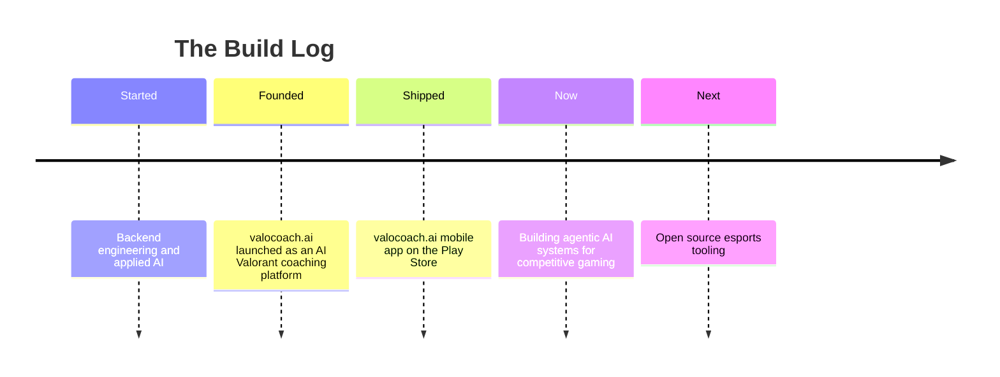

<!-- HEADER BANNER -->


<div align="center">


<br/>

[](https://www.mrsagarjain.com/)
[](https://www.valocoach.ai/)
[](https://play.google.com/store/apps/details?id=com.valocoachai)

<br/>


</div>

<!-- CUSTOM CYAN DIVIDER -->


<div align="center">

> ### *"Security is just an illusion shaped by our need to feel in control."*

</div>

## 🧬 Bio

```yaml
name: Sagar Jain
role: AI Engineer & Esports Software Developer
founded: valocoach.ai (AI powered Valorant coaching platform)
currently_building: AI systems that make gamers unstoppable
currently_learning: [RAG, Agentic AI, Deep Learning, LangGraph]
ask_me_about: [AI backends, LLM pipelines, game analytics, startups]
superpower: Shipping 10x faster when games are involved 🎮
```

<details>
<summary><b>📖 More about me</b></summary>

<br/>

I build AI systems where intelligence meets gameplay. My focus is backend engineering and applied AI: designing LLM pipelines, retrieval augmented systems, and analytics that turn messy game data into decisions players can act on.

I founded **valocoach.ai**, an AI powered Valorant coaching platform that analyzes gameplay and delivers personalized coaching at scale. These days I am deep in agentic AI, LangGraph workflows, and deep learning, always with one goal: ship useful products fast.

When something connects AI and gaming, I move at double speed.

</details>


## 🗺️ Currently

```text
🔭  Building   →  AI systems for competitive gaming
🌱  Learning   →  RAG, Agentic AI, Deep Learning, LangGraph
💬  Talking    →  AI backends, LLM pipelines, game analytics
⚡  Shipping   →  valocoach.ai features and experiments
🤝  Open to    →  collaboration on AI x gaming products
```


## 🔥 Active Missions

| 🎯 Focus | 📍 Status |
|-----------|-----------|
| AI systems for gaming & esports | 🟢 `Active` |
| RAG pipelines & Agentic AI | 🟢 `Learning` |
| Deep Learning & LLM architectures | 🟢 `Exploring` |
| LangGraph & LangChain workflows | 🟢 `Building` |
| Open source esports tools | 🟡 `Coming soon` |


## 🏁 Milestones




## 🎯 Featured Build

<div align="center">

<table>
<tr>
<td width="50%" valign="top">

### 🔴 valocoach.ai

> **AI powered Valorant coaching & analysis platform**

Turning raw gameplay into actionable intelligence. Real time analysis, personalized coaching, and insights that help players climb the ranks.

`Python` · `FastAPI` · `LLMs` · `RAG` · `Game Analytics`

[](https://www.valocoach.ai/)
[](https://play.google.com/store/apps/details?id=com.valocoachai)

</td>
<td width="50%" valign="top">

### 🧪 What's Next

> **AI systems for competitive gaming**

Exploring agentic pipelines, retrieval augmented coaching, and deep learning models that understand the game like a pro analyst.

`Agentic AI` · `LangGraph` · `Deep Learning` · `Vector Search`

[](https://github.com/mrsagarjain1)

</td>
</tr>
</table>

<!-- SCREENSHOT STRIP: replace these with real valocoach.ai screenshots placed in an /assets folder -->
<!--


-->

</div>


## 🧠 Arsenal

<div align="center">


<br/><br/>


</div>

> I lean on Python and FastAPI for fast, typed backends, MongoDB and Redis for state and speed, and the LangChain stack with vector search for everything LLM and RAG. Docker and AWS keep it shippable.


## 📊 Battle Stats

<div align="center">

<!-- Theme-aware stats: dark theme on dark mode, light theme on light mode -->
<picture>
  <source media="(prefers-color-scheme: dark)" srcset="https://github-readme-stats.vercel.app/api?username=mrsagarjain1&theme=tokyonight&hide_border=true&include_all_commits=true&count_private=true&ring_color=00F0FF" />
  <source media="(prefers-color-scheme: light)" srcset="https://github-readme-stats.vercel.app/api?username=mrsagarjain1&theme=default&hide_border=true&include_all_commits=true&count_private=true&ring_color=0969DA" />
  
</picture>
<picture>
  <source media="(prefers-color-scheme: dark)" srcset="https://streak-stats.demolab.com/?user=mrsagarjain1&theme=tokyonight&hide_border=true&ring=00F0FF&fire=FF4655&currStreakLabel=00F0FF" />
  <source media="(prefers-color-scheme: light)" srcset="https://streak-stats.demolab.com/?user=mrsagarjain1&theme=default&hide_border=true" />
  
</picture>

<picture>
  <source media="(prefers-color-scheme: dark)" srcset="https://github-readme-stats.vercel.app/api/top-langs/?username=mrsagarjain1&theme=tokyonight&hide_border=true&layout=compact" />
  <source media="(prefers-color-scheme: light)" srcset="https://github-readme-stats.vercel.app/api/top-langs/?username=mrsagarjain1&theme=default&hide_border=true&layout=compact" />
  
</picture>

</div>


## 📈 Contribution Activity

<div align="center">


</div>

## 🐍 Contribution Trail

<div align="center">

<!-- Generated by the snake GitHub Action into the output branch -->
<picture>
  <source media="(prefers-color-scheme: dark)" srcset="https://raw.githubusercontent.com/mrsagarjain1/mrsagarjain1/output/github-contribution-grid-snake-dark.svg" />
  <source media="(prefers-color-scheme: light)" srcset="https://raw.githubusercontent.com/mrsagarjain1/mrsagarjain1/output/github-contribution-grid-snake.svg" />
  
</picture>

</div>


## 💭 Random Dev Wisdom

<div align="center">


</div>


## 🤝 Enter the Lobby

<div align="center">

**Open to collaboration on AI x gaming products. Let's build something.**

<br/>

[](https://www.mrsagarjain.com/)
[](https://www.valocoach.ai/)
[](https://play.google.com/store/apps/details?id=com.valocoachai)
[](https://www.linkedin.com/in/mrsagarjain1/)
[](https://github.com/mrsagarjain1)
[](https://x.com/mrsagarjain1)
[](mailto:mrsagarjain1@gmail.com)

</div>

<!-- FOOTER BANNER -->

